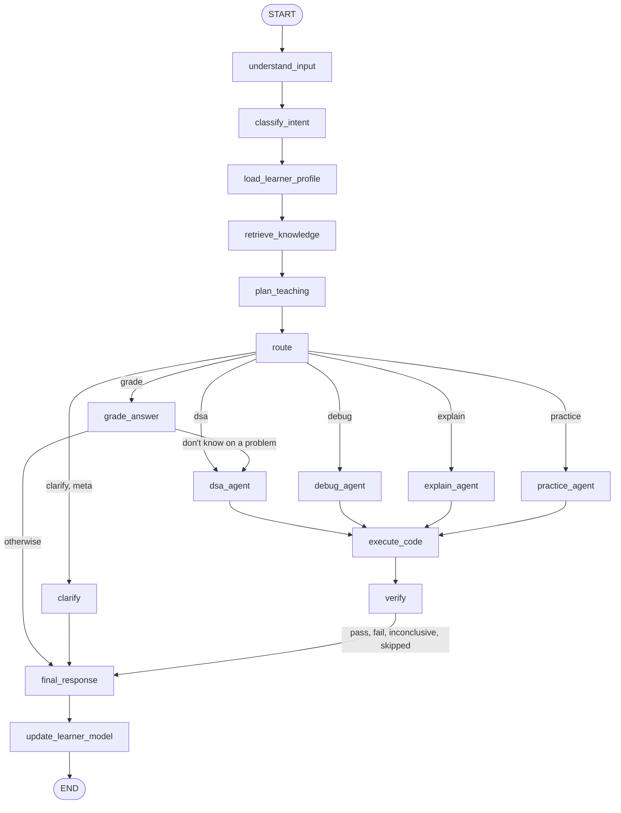

# Audit report: adaptive behaviour failures

Branch `experimental`. File and line references are as of commit `957684d`
(the audit baseline). Status of each finding is in section 6.

## 1. Scope and two corrections to the brief

The brief described a local Ollama stack and asked for the LangGraph Postgres
checkpointer. The code says otherwise, and the owner confirmed both points on
2026-10-05:

| Brief | Code on `main` / this branch | Decision |
|---|---|---|
| Local Ollama (`qwen3.5:9b`, `qwen2.5-coder:7b`), Groq/OpenRouter commented out | `app/config.py:19` `LLMProvider = Literal["groq", "openrouter"]`; no `app/llm/ollama.py`. The Ollama port lives only on `experiment/local-ollama`, which has diverged 5 commits each way | Target the cloud stack. The fixes here are in routing, state and input handling, so they port |
| Session memory through `AsyncPostgresSaver` | `app/graph/build.py:165` compiles with no checkpointer; `langgraph-checkpoint-postgres` is not installed. State is one frozen object per turn; memory is the conversation store keyed by `conversation_id` | Keep the conversation store, fix its gaps (A-02). No new dependency |

Two failing sessions were audited:

- **Session M** (the brief): LeetCode 678 from a screenshot, turns T1-T5 and the
  `'*'` rendering bug.
- **Session C** (`docs/current-behavior.md`, conversation
  `648416bd-5c4d-48ae-a956-b15abb5239ea` in Postgres): Trapping Rain Water code
  pasted with no statement, turns C1-C5.

Session M no longer reproduces: its fixes were already in the working tree
(committed here as `09824d2`, logged as ERR-005 to ERR-007 in `fixedErrors.md`)
and `tests/graph/test_conversation_regression.py` replays T1-T5 green. Session C
reproduces offline, turn for turn, through the real graph with a scripted model.
Every new finding below comes from it.

Baseline before any fix: `pytest tests` 1802 passed, 16 skipped; `pyright app
tests` 0 errors.

## 2. Request path for one chat turn

| Hop | Where |
|---|---|
| Frontend builds the multipart body, sends `conversation_id` when it has one | `frontend/js/streaming.js:175-204` |
| `POST /chat/stream` (or `/chat`) | `app/graph/api.py:385` (`:251`) |
| User from the bearer token only, never from the body | `app/auth/deps.py` `get_current_user` |
| Conversation resolved or created, ownership checked, 404 otherwise | `app/graph/api.py:209` `_ensure_conversation` |
| Graph run; `user_id` and `conversation_id` travel in `GraphContext` | `app/graph/build.py:359` `stream_graph`, `:186` |
| Text normalised; image read by the vision model, bytes dropped from state | `app/graph/nodes.py:175` `understand_input`, `app/input/vision.py` |
| Intent: rules, then the model, then a keyword fallback | `app/graph/nodes.py:220`, `app/input/intent.py:474` |
| Profile, last messages, active problem, pending check, session progress loaded | `app/graph/nodes.py:240` `load_learner_profile` |
| Retrieval (gated), then this turn's relation to the active problem | `app/graph/nodes.py:613`, `:684` `_problem_update` |
| Teaching plan from intent, profile and hint progress | `app/graph/nodes.py:339`, `app/agents/planner.py:545` |
| Route decision | `app/graph/routing.py:224` `select_route` |
| Agent: `dsa_agent` `:1261`, `debug_agent` `:1480`, `explain_agent` `:1684`, `practice_agent` `:1515`, `grade_answer` `:1622`, `clarify` `:1904` | `app/graph/nodes.py` |
| Sandbox run and verdict | `app/graph/nodes.py:1763`, `:1804`, `app/execution/` |
| Reply assembled without a model call; symbols protected | `app/graph/nodes.py:1937`, `app/response/generate.py:307`, `app/response/format.py` |
| Messages, active problem, pending check, learning event, profile written | `app/graph/nodes.py:2627` `update_learner_model` |
| `ChatResponse` in the SSE `done` frame | `app/graph/api.py:229`, `:375` |
| Message shape, hint card, markdown | `frontend/js/streaming.js:124`, `frontend/js/ui.js:193`, `:356` |

## 3. The graph

Every node is wrapped in `safe_node` with a per-node fallback
(`app/graph/nodes.py:2714`), so an exception degrades that node and records a
`NodeError` instead of failing the turn. `debug_agent`, `dsa_agent` and
`explain_agent` each run their own compiled subgraph. No checkpointer, no
interrupts; `RECURSION_LIMIT` is 20.

## 4. Audit by area

**A. Session memory.** No checkpointer, by design. A turn's memory is loaded
from Postgres in `load_learner_profile` and written back in
`update_learner_model`. Verified against the database: the Session C
conversation holds all ten messages, in order, under one `conversation_id`, and
the frontend sends that id on every turn. Storage was never the fault. The gap
is what gets stored as the conversation's subject (A-02).

**B. Problem context.** A statement from text or an image is stored in
`conversations.active_problem` and re-attached to follow-ups
(`inherit_active_problem`). The image itself is read once and its bytes are
dropped. A turn that carries only code stores nothing (A-02).

**C. Profile.** Loaded every turn, read by the planner (skill per topic and
family, preferences, `watch_errors`), passed to the solver as `skill_level`, and
updated from the turn's learning event by EWMA in `update_learner_model`. Working.

**D. Router.** The classifier sees only the current turn
(`app/input/intent.py:295`). Deterministic rules after it repair the known
misreads (meta questions, study plans, "I don't know"). Session C found the next
holes in those rules (A-01, A-03, A-04) and the underlying cause is A-08.

**E. Prompts.** A guided hint is the solver's own problem-specific step and
renders without headers. The fixed ladder template is the fallback only.

**F. Rendering.** `'*'` is fixed at both layers (`protect_symbols`, and the
frontend emphasis regex). A new duplication bug is in the frontend (A-07).

**G. Sandbox.** Nothing is called "verified" without a sandbox pass; the patch
and the reference solution are both gated on one. The gate works; what reaches
it does not, because a pasted snippet often is not a runnable module (A-05).

**H. RAG.** Retrieval is gated by intent and a score floor. The "corpus dump" in
Session C is not retrieval: it is the pattern's canned teaching sections,
rendered because the plan was `full` on a turn that had nothing to reveal (A-06).

**I. General.** `.gitignore` gaps fixed in `957684d`. `fixedErrors.md` still
tells the reader to run a Streamlit frontend that no longer exists (A-11).

## 5. Findings

| ID | Sev | Where | Root cause | Evidence | Fix plan |
|---|---|---|---|---|---|
| A-01 | critical | `app/graph/routing.py:42` `INTENT_ROUTES`; `app/graph/nodes.py:684` `_problem_update` | A turn that carries the learner's code and no problem statement is routed by the classifier's label alone. "give correct code of this" + code is labelled `DSA_SOLVE`, so it goes to the hint ladder and the code is never read. Target behaviour section 10: the code is the primary evidence | Stored intents for the session: `DSA_SOLVE` on turns 1, 3, 5. Offline replay: route `dsa`, reply is Hint 1 | Code with no statement on a DSA-route intent is a debug turn, decided by rule after classification |
| A-02 | critical | `app/graph/nodes.py:2514` `active_problem_update` | Only a problem statement becomes the conversation's subject. A code-only turn stores nothing, so every follow-up has `problem_relation == "none"` and starts from zero | Replay: `ACTIVE: None` after C1; C2 and C3 see no code and no problem | Store the code as the conversation's subject. A follow-up with no code of its own inherits it and stays on the debug route |
| A-03 | high | `app/agents/planner.py:116` `_EXPLICIT_ASK_RE` | The explicit-ask phrase list does not match "give python code", "give correct code", "i asked for the code" | Replay C3: plan rationale `escalation_denied_no_explicit_ask`; reply is Hint 2 | Widen the phrase list (still a fixed list, never a model) |
| A-04 | high | `app/graph/nodes.py:1920` `clarify`; `app/graph/routing.py:170` `_guidance_without_ask` | Any `GENERAL_GUIDANCE` turn with no plan ask is answered with the greeting, including a complaint in the middle of a session | Replay C4: "i asked for python code" gets "Hi! Share a problem statement..." | With a subject in the conversation, such a turn continues it. Without one, the reply asks what is needed and is not a greeting |
| A-05 | high | `app/agents/debugger.py:68` `extract_learner_code`; `app/execution/testgen.py:67` | Pasted code is used as typed. The three common paste shapes are not runnable modules: a method body whose first line lost its indentation, a body with a top-level `return`, and a LeetCode `class Solution`. The debugger then reports the paste as the bug | Live C5: "syntax error ... line 5", "0/0 test cases passed", no diagnosis of `left -= 1` | Repair the snippet once, when input is understood: re-align, wrap a bare body in a function, give `Solution` methods a module-level entry point. Parsing only, never execution |
| A-06 | high | `app/graph/nodes.py:1312`; `app/response/generate.py:100` | When a reveal is granted but no reference can be verified, the turn keeps `assistance_level == "full"` and renders every survey and corpus section around a one-line refusal | Live C2: recognition, intuition, brute force, pseudocode and "Final guidance" for a turn that asked where the bug is | A granted reveal with nothing to show renders the honest note and nothing else |
| A-07 | medium | `frontend/js/streaming.js:132` | When the hint is the whole answer, `answerBody` is empty and the code falls back to `payload.response`, which is the same hint. It then renders in the body and again in the hint card | Live C1 and C3: the hint paragraph appears twice | No fallback when a hint card already shows the text |
| A-08 | medium | `app/graph/build.py:132`; `app/input/intent.py:295` | The classifier runs before the conversation is loaded and sees one message. Every follow-up misroute so far traces back to this | Graph order; stored intents | Load the conversation first; give the classifier a short, delimited context (active subject, pending question, last messages) |
| A-09 | medium | `app/graph/build.py:165` | No LangGraph checkpointer | See section 1 | Won't fix (owner decision) |
| A-10 | medium | `app/execution/synth.py:322`; target behaviour section 9 | An explicit ask for code is refused when the sandbox cannot verify a reference (no runner, or the model's reference fails its own cases). The docs conflict: target behaviour says give the code; AD-4 and `CLAUDE.md` say never show unverified code | Live C2 | Deferred. The refusal stays; A-06 makes it short and honest. See section 7 |
| A-11 | low | `fixedErrors.md:36` | Run instructions name `frontend/app.py` (Streamlit), which is gone | File listing | Correct the instructions |
| A-12 | low | `.gitignore` | `node_modules`, data volumes, model files and logs were not ignored | File | Fixed in `957684d` |
| A-13 | low | `app/response/format.py` `render_verdict` | A run with no test cases that crashed reads "0/0 test cases passed" | Live C5 | Say that the code crashed and that no cases were available |

### Failing turns mapped to findings

| Turn | Symptom | Findings |
|---|---|---|
| M T1 | Template sections, generic "pin down inputs" hint | ERR-005 (fixed in `09824d2`) |
| M T2 | "I'm not sure which problem" | ERR-005 (fixed in `09824d2`), A-08 |
| M T3, T4 | Study plan in reply to a follow-up | ERR-005 (fixed in `09824d2`), A-08 |
| M T5 | Rigid sections, generic "Hint 2 of 4" | ERR-005 (fixed in `09824d2`) |
| M `'*'` | Rendered as `''` | ERR-005 (fixed in `09824d2`) |
| C1 | Code pasted, asked for the correct code, got Hint 1, shown twice | A-01, A-05, A-07 |
| C2 | Asked for the code and the bug, got a pattern survey and a refusal | A-01, A-02, A-06, A-10 |
| C3 | "give python code" got Hint 2 | A-02, A-03, A-07 |
| C4 | "i asked for python code" got a greeting | A-02, A-04 |
| C5 | "fix this code" got an indentation complaint, bug not found | A-05, A-13 |

A finding added while fixing:

| ID | Sev | Where | Root cause | Evidence | Fix plan |
|---|---|---|---|---|---|
| A-14 | high | `app/agents/debugger.py` `_EXPLAIN_SYSTEM`; `app/graph/subgraphs/debug.py` `_explain` | The explanation prompt tells the model "a sandbox has established that the code fails; that failure is FACT" on every debug turn, including turns where the code passed or nothing was proven. On working code the model is instructed to find a bug that is not there | Prompt text; `_explain` is deliberately not gated on an established failure | A second prompt for the unproven case that allows "no bug found"; no explanation call at all when the learner's code passed |
| A-15 | medium | `app/graph/subgraphs/debug.py` `run_debug` | With no sandbox (Docker not running) the debugger returns before reading the code: no static findings, no explanation, only "no code was executed" | Offline replay with `runner=None` | Deferred, see section 7 |

## 6. Status

| ID | Status | Commit | What changed |
|---|---|---|---|
| A-01 | fixed | `f4ea2ac` | Code with no statement on a hint-ladder or catch-all label is a debug turn (`_problem_update`). Example input alone (`nums = [2, 7, 11, 15]`) does not count as the learner's code |
| A-02 | fixed | `f4ea2ac` | Code shared with no statement is stored as the conversation's subject (`_shared_code_subject`, key `_c...`) and re-attached to follow-ups (`inherit_active_problem`). It never replaces a stored statement |
| A-03 | fixed | `f4ea2ac` | Phrase lists widened in `planner._EXPLICIT_ASK_RE` and `grader._HELP_RE`; new `asks_for_fix`. A debug turn that asks for the fix is planned at `full` (`fix_requested`), except in Challenge mode |
| A-04 | fixed | `f4ea2ac` | Such a turn continues the conversation's subject. With no subject the reply asks what is needed; only a greeting gets the greeting |
| A-05 | fixed | `5a12e1a`, wired in `f4ea2ac` | New `app/input/snippet.py`, applied once in `understand_input`. `ast` only |
| A-06 | fixed | `f4ea2ac` | A granted reveal with nothing verified renders the note alone |
| A-07 | fixed | `2166207` | No fallback to `payload.response` when a hint card shows the text |
| A-08 | fixed (round 2) | `7009f51`, `c69e1b7` | See section 10 |
| A-09 | won't fix | | Owner decision, section 1 |
| A-10 | fixed (round 2, owner decision) | `7009f51` | See section 10 |
| A-11 | fixed | this commit | Run instructions corrected |
| A-12 | fixed | `957684d` | |
| A-13 | fixed | `06bc066` | "failed in the sandbox before any test case ran", with the reason |
| A-14 | fixed | `06bc066` | `_READ_SYSTEM` prompt when no failure is established; no explanation call when the code passed |
| A-15 | fixed (round 2, owner decision) | `7009f51` | See section 10 |

Also changed: a debug turn's patch is shown when the learner's code failed in
the sandbox and the patch then ran to completion with no test cases to judge
it. It is labelled "executed, not verified" and `fixed` stays false, so no
skill is credited. The sandbox findings are one section instead of two under
the same title. "what's its name" is recognised as a question about the
conversation.

## 7. Deferred, and where the docs disagree

_Superseded on 2026-10-05: A-08, A-10 and A-15 were decided by the owner and done in round 2 (section 10). The text below is the state after round 1._

**A-08, classifier context.** Giving the classifier the conversation means
reordering two graph nodes and changing the prompt that every routing eval was
measured against. The deterministic rules now decide every case measured so
far, and the replay suite (`eval.behavior.replay`) should be re-run against the
live model before and after such a change. Not done in this pass.

**A-10, explicit ask against the verification rule.** `docs/target_behavior.md`
section 9 says an explicit ask for the code is honoured. `CLAUDE.md` ("never
trust LLM claims of correctness") and decision AD-4 say a reference solution is
shown only after the sandbox passes it. The brief says the docs and
`target_behavior.md` win, but both sides here are docs. The refusal stays for a
reference solution nothing could run. Where the sandbox did run the code, the
debug route now shows a patch that executed cleanly with an honest label. Owner
decision needed on whether an unrun reference may be shown with a warning.

**A-15, no sandbox.** Reading the code without a sandbox would cost two model
calls for an answer that cannot be checked. Nine tests pin the current
zero-call behaviour as a deliberate choice, so it was left alone. On a machine
where Docker is not running the debugger is close to useless; worth revisiting.

**Stack.** `CLAUDE.md` said Streamlit and listed no LLM provider. Corrected.

## 8. Verification

| Check | Before | After |
|---|---|---|
| `pytest tests` (Postgres and Qdrant up) | 1802 passed, 16 skipped (infra down) | 1867 passed, 2 skipped (opt-in live LLM) |
| `pyright app tests` (strict) | 0 errors | 0 errors |
| `ruff check .`, `ruff format --check .` | clean | clean |

New tests: `tests/graph/test_code_first_regression.py` (Session C on one
conversation id, Challenge mode, refused reveal, cross-session profile, phrase
lists, vague follow-ups) and `tests/input/test_snippet.py`. Session M is
`tests/graph/test_conversation_regression.py`, unchanged and green.

### Live sessions, 2026-10-05

`POST /chat` against the running API (Groq), real Docker sandbox, a fresh
account each time, one conversation per run. Run on the final code:
conversation `62aa64e9-1698-43ce-af01-79689734811c`. An earlier run, before the
review fixes: `464600e0-5fb5-490d-af74-127b1aed0f93`. Full replies are in the
`messages` table.

| Turn | Route, plan | Sandbox | Reply |
|---|---|---|---|
| C1 "give correct code of this" + working code | debug, `full` (`fix_requested`) | your code passed 6/6 | Names the approach, then "yours passed every test case in the sandbox, so there is no fix to show -- the version you shared is the one to keep." |
| C2 "give full code and tell me where is the bug" | debug, follow-up on the stored code | passed 6/6 | Same finding. No hint, no refusal, no survey |
| C3 "give python code" | debug, follow-up | passed 6/6 | Same finding |
| C4 "i asked for python code" | debug, follow-up | passed 6/6 | Same finding, no greeting |
| C5 "fix this code" + the broken variant | debug, `full` | your code: IndexError on line 10 | Names `left -= 1`, shows the corrected function |

C5 took two different paths in the two runs, and both are correct:

- Earlier run: the model's test cases validated, so the fix was run against
  them. "A fix was found and verified in the sandbox: all 6 case(s) passed."
  39.5 s, 5 model calls.
- Final run: test synthesis produced no usable suite. The fix was still run,
  shown, and labelled "executed, not verified"; the turn's verdict is
  `inconclusive`. 58.8 s, 7 model calls.

So whether a fix is verified or only executed depends on test synthesis
succeeding, which varies between runs on the same input.

Not run live: Session M (no LeetCode 678 screenshot fixture in the repo) and
the browser UI (the A-07 change is a one-line guard and has no JS test).

## 9. Remaining risks

- Test synthesis is not deterministic (see the two live runs), so the same
  broken code can get a verified fix one time and an executed-only fix the next.
- C2 to C4 repeat the same analysis for the same code. Correct, but a learner
  who asks three times probably wants the code printed back; the reply only
  says which version to keep.
- A wrapped snippet's line numbers are one higher than the learner's paste when
  no sample-input line preceded the body.
- `repair_snippet` handles Python only. Other languages pass through untouched.
- The widened ask phrases are still fixed lists. Phrasings outside them fall
  back to the classifier's label (A-08).

## 10. Round 2 (2026-10-05)

### Git state before the work

`git fetch origin` moved nothing: `git log main..origin/main` is empty, and
`origin/main` was last pushed on 2026-10-03. Local `main` is 8 commits ahead of
`origin/main`. `main..experimental` at the start of round 2 was 9 commits: one
from `fix/conversation-memory-tutor` (`09824d2`, the work that was uncommitted
when round 1 began) and eight from round 1 (`957684d` to `19c1b23`).

### Owner decisions applied

| Decision | What changed | Commit |
|---|---|---|
| A-10: never refuse an explicit code ask | Outside Challenge mode the ask is honoured on any turn. `verified_reference` always tries to verify and returns the candidate either way; an unverified one is shown under "**Not verified in sandbox**" with the reason. AD-4 revised in `docs/features/ADAPTIVE-upgrade.md`, `CLAUDE.md` updated | `7009f51` |
| A-15: static review with no sandbox | `ast` checks plus ONE model call that reads the code, labelled "Not executed". No patch, no verdict. Nine pinned tests updated | `7009f51` |
| A-09: no checkpointer | Unchanged | |

### Fixes

| Fix | What changed | Commit |
|---|---|---|
| F1 (A-08) | Graph order is now `understand_input -> load_learner_profile -> classify_intent`. The classifier is shown the active subject, the earlier one, the pending question, the learner's skill on the topic and the last six messages, and returns `refers_to_previous`, `earlier_subject`, `asks_for_code`, `about_conversation` with its label. Those flags decide follow-up, meta, subject switch and code ask. The phrase lists from `f4ea2ac` run only when the model gave no confident reading | `7009f51`, `c69e1b7` |
| F2 | An ask for the code on a stored code subject returns code: the fix when a bug was proven, otherwise the learner's own code, tidied and commented by one model call and re-run in the sandbox. If the tidied version does not hold up, their code is returned as shared | `7009f51` |
| F3 | The statement's examples are always in the suite. Synthesis stays at temperature 0 with one retry. Sandbox-validated cases are cached in Postgres (`test_suite_cache`, migration `c6d7e8f9a0b1`), keyed by problem title when the statement leads with one, else by a hash, and reused. An attempt pasted for the active problem is judged by that problem's examples | `7009f51` |
| F4 | The approach and the bug explanation are one call instead of two. A cached suite removes the synthesis call on later turns | `7009f51` |
| F5 | `CodeBlock.line_offset` records the lines the snippet repair put above the learner's code; the debugger reports line numbers the learner typed | `7009f51` |

Deterministic guards kept, because they are policy: Challenge mode, the client
assistance cap, the explicit study-plan ask, user-code-first, and
`planner.wants_the_code`.

### Findings made during round 2

| ID | Sev | Root cause | Fix |
|---|---|---|---|
| A-16 | high | The Qdrant container was down for the whole of the owner's session (`Exited (255)` when Docker Desktop stopped; compose had no restart policy). Every turn logged "knowledge dense retrieval failed: ResponseHandlingException" and ran on keyword search only | `restart: unless-stopped` on both services; the log now names the underlying cause and says retrieval continues on keywords. `1acc9dd` |
| A-17 | high | Since round 1 a follow-up on a code subject carries the stored code, and "this turn has code" blocked grading and meta questions. This was the cause of the two failing examples in the baseline replay | `routing._own_code`. `7009f51` |
| A-18 | high | The model returned `asks_for_code: true` for a beginner's "help me solve ... I don't understand how to start", and for "give me step by step" one run in two | `planner.wants_the_code`: believed only for a short message with no learning ask. `7009f51`, `c69e1b7` |
| A-19 | high | Session progress was stored with a computed field that the next read rejected, so the WHOLE record read back empty | `conversation.progress_payload`. `7009f51` |
| A-20 | medium | `tests/auth/test_tokens.py::test_tampered_signature_is_invalid` checked the last character of the signature but replaced the first, so it failed about one run in 64 | Corrected. `7009f51` |

### Routing accuracy: `eval.behavior.replay`, live

| | Checks | Examples |
|---|---|---|
| Before round 2 (`19c1b23`) | 126 / 130 | 3 / 5 |
| After the first F1 cut | 115 / 130 | 2 / 5 |
| After round 2 (`c69e1b7`) | 130 / 130 | 5 / 5 |

Before: `adaptive_002` and `adaptive_004` each failed two checks on turn 2, the
learner's reply to the tutor's question went to the explain agent instead of
being graded (A-17). The first cut of F1 made it worse: with A-10 applied, the
model's `asks_for_code` handed the beginner in `adaptive_001` the full solution
on turn 1 (A-18). The replay is what caught that.

### Latency

Per-node timing from `/chat/stream`; one run each, same messages.

| Turn | Before: calls, time | After: calls, time |
|---|---|---|
| Tutor turn 1 (Two Sum, beginner) | 2, 2.9 s | 2, 4.3 s to 34.6 s |
| Tutor turn 2 (answer graded) | 2, 3.5 s | 1 to 2, 2.4 s to 8.1 s |
| Tutor turn 3 ("I don't know") | 1, 1.2 s | 1, 2.0 s to 17.5 s |
| Debug turn (KeyError) | 5, 10.2 s | 4, 10.2 s to 27.0 s |
| Debug follow-up, suite cached | not possible | 3, 6.9 s to 33.2 s |
| Code reveal (reference, verified) | 3 | 3 to 4, 12 s to 60 s |

Model calls are what the code controls, and they went down or stayed equal: a
tutor turn is 1 to 2 calls (target 3 or fewer: met), a debug turn went from 5
to 4, and to 3 once the suite is cached. Wall-clock time did NOT improve and
cannot be read as a regression either: the same single classifier call took
0.8 s in the morning baseline and up to 16.9 s in the afternoon, after several
hundred calls against the same Groq keys. Where a turn ran unthrottled the
target holds (tutor turns of 2 to 5 s in scenarios 1, 6 and 7); under
throttling it does not. A code reveal is the slow turn: reference plus up to
one repair call plus two sandbox runs.

Not done under F4: classification and relation detection were already one call
after F1 (the relation comes from the classifier's flags). The classifier
prompt grew by about 250 tokens.

### Live behaviour

All eight scenarios pass. Transcripts, per-behaviour scoring and the earlier
failing runs are in `docs/LIVE_BEHAVIOR.md`.

### Verification

| Check | Result |
|---|---|
| `pytest tests` (Postgres, Qdrant up) | 1885 passed, 2 skipped (opt-in live LLM) |
| `pyright app tests` (strict) | 0 errors |
| `ruff check .`, `ruff format --check .` | clean |
| `alembic upgrade head`, `alembic check` | applied, no pending operations |
| code-review on `19c1b23..c69e1b7` | 3 findings, all fixed in the commit that follows it: a long message with a listed phrase lost its code ask; the "nothing to fix" note could contradict the label above it; `explain_bug` duplicated `read_code` |

The three review fixes landed after the live scenarios were run. They change `wants_the_code` only for a message that contains a listed phrase, which none of the scenario messages do, so the scenarios were not re-run.

### Remaining risks after round 2

- The classifier's flags are a model's reading and vary between runs on the
  same message. `wants_the_code` bounds the costly direction (a false "asks for
  the code"). A false "does not refer to the previous subject" still drops the
  problem for that turn, except for "I don't know" and replies to the tutor.
- Latency depends on the provider's throttling far more than on this code.
- Tree and linked-list problems cannot be run: no test suite is built for code
  that takes a node (scenario 4 is `inconclusive`).
- The suite cache is per learner, deliberately, so a first-time learner on a
  problem without examples still depends on test synthesis succeeding.
- "Not verified in sandbox" code can be wrong. The label and the real
  Execution line are the only protection; that is the owner's decision.
- One earlier subject is remembered, not a history of them.
- Scenario 8: the profile carries across sessions and is cited, but the level
  of help did not change because no skill crossed a threshold.
- Round 2 is two large commits rather than one per fix.
